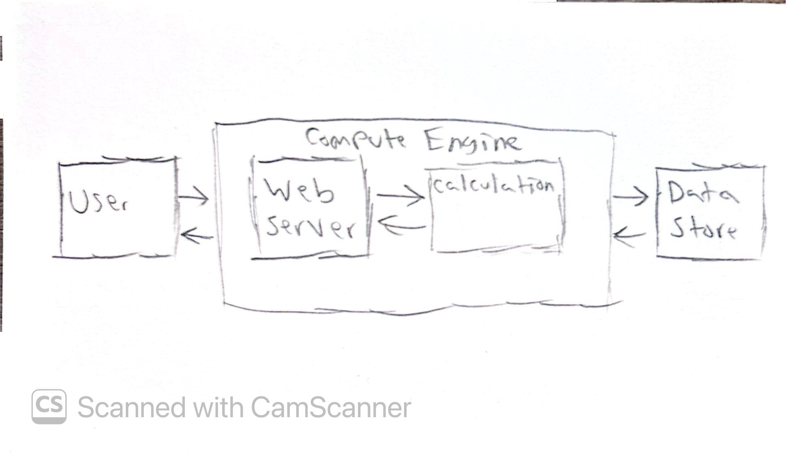

# Dakotas_Software_Engineering_Repo
#Computation system design:
#When given an integer input, the program will whether that number appears in the first 15 digits of pi and at what placement it first appears. 
#
